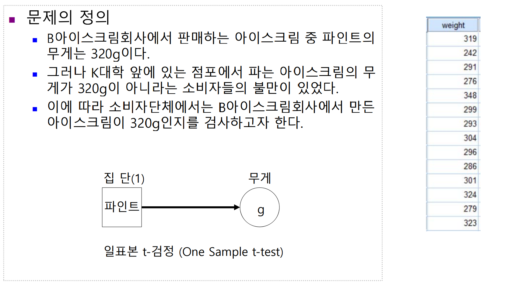

# R_Tutorial

------

# **MARKDOWN 사용법**

 

<iframe width="640" height="360" src="https://www.youtube.com/embed/dUbp9wAy178" frameborder="0" gesture="media" allowfullscreen=""></iframe>

[마크다운의 문법을 알아보자 (1편) (devorah.studio)](https://enoz.devorah.studio/65)

[Markdown 특수문자 사용](https://ascii.cl/htmlcodes.htm)

[수식블록](https://dev-lagom.tistory.com/35)

[수식블록상세](https://math.meta.stackexchange.com/questions/5020/mathjax-basic-tutorial-and-quick-reference)

------

## 통계분석방법

### 1. One Sample t-test

#### 가설

**귀무가설(*H*₀ ) : 파인트의 무게는 320g이다. ->** ***H*₀ : μ = 320**

**연구가설(*H*₁): 파인트의 무게는 320g이 아니다.  ->**  ***H*₁ : μ ≠ 320**

#### 통계치

$$
\begin{align} 
& 표본(n) : 100 \\
& 표본평균(\bar{x}) : 295.44 \\
& 표본표준편차 (s): 20.04,\ 표준오차(\frac {s} {\sqrt 𝑛}) : 2.004
\end{align}
$$

#### 임계치
$$
x_{critical}=μ_0 \pm 1.984 \frac{s}{\sqrt𝑛}= 320\pm1.984\frac{20.04}{\sqrt 100}=320\pm 3.97=[316.02,323.98]
$$

#### 검정통계량

$$
t_{cal} = \frac {\bar x - μ_0} {\frac{s}{\sqrt 𝑛}} = \frac { 295.4 - 320} {\frac{20.04}{\sqrt 100}} = \frac {-24.6}{2.004} = -12.25
$$

#### 유의확률(***p-value***) 계산

$$
\pmb p-\pmb value = 0.000
$$

------

## 분석결과

K대학 앞 점포에서 파는 아이스크림의 무게(295.44g)는 B아이스크 림회사에서 발표한 파인트의 무게(320g)보다 통계적으로 유의하게 적었다.(t(검정통계량)=-12.252, p(유의확률= 0.000).

|  구분  | 평균(M) | 표준편차(SD) | 검정량통계(t) | 유의확률(p) |    신뢰구간    |
| :----: | :-----: | :----------: | :-----------: | :---------: | :------------: |
| 무게() | 295.44  |    20.04     |    -12.526    |    0.000    | 316.02 ~323.98 |

